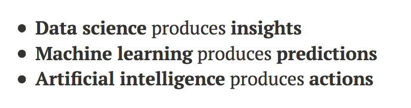
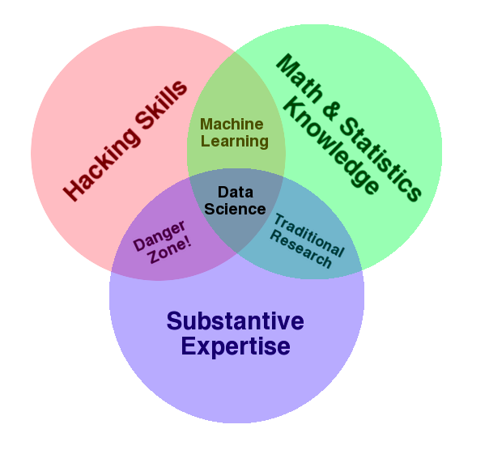

# What is machine learning? {#explainingmachinelearning}

## Machine learning for MD's

David Robinson does the nicest job explaining the difference between artificial intelligence, machine learning, and data science in this post <http://varianceexplained.org/r/ds-ml-ai/>. My goal with this page is to convey these ideas in a way that is relevant to my colleagues in pathology, radiology, neuroradiology, oncology, neurosurgery, and neuro-oncology. 

Why? 

Because systems that understand these ideas will use them to improve patient care. Systems that don't, won't. As a matter of fact, systems that remain in the dark will provide increasingly expensive, dysfunctional, inefficient, and ineffective care in the pursuit of what they *believe* (incorrectly) to be quaternary care--whatever the hell that is. 

Generally, I think that David Robinson's descriptive (as opposed to prescriptive) approach to these ideas is a good one. Prescriptive approaches are exceedingly complex and fragile. See, for instance, the editorial in the August 2021 issue of **Neurosurgery**: <https://pubmed.ncbi.nlm.nih.gov/34015816/>. The authors trade simplicity for breadth and appear to be motivated more by intellectual property concerns than by a desire to guide colleagues through the process of data collection, analysis, and modeling. Hadley Wickham and Garrett Grolemund's **R for Data Science** or Gareth James et al.'s **An Introduction to Statistical Learning** offer much more investigator-based approaches to the field, even if the majority of their book can be said to be outside of the field of AI/ML, in the case of **R4DS** (probably only the chapters on modeling can be said to fit into ML). 

I will adopt Robinson's convention: 

But let's back up and ask: what role does DS/ML play? Drew Conway's classic description of data science is helpful <http://drewconway.com/zia/2013/3/26/the-data-science-venn-diagram>. 

The Conway venn diagram looks like this: 

## Supervised versus unsuperised learning

## Classification versus regression
